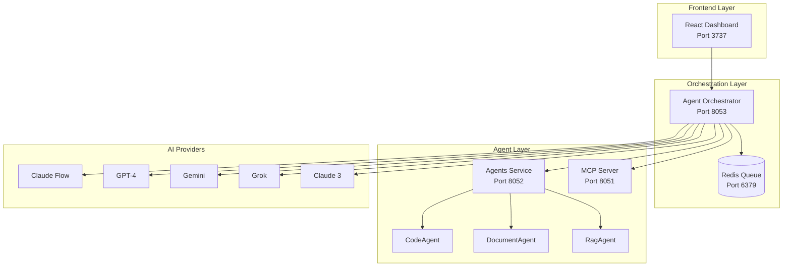

# 🚀 Archon Multi-Agent AI Orchestration System

## Revolutionary Multi-AI Collaboration Platform

Dieses System ermöglicht die nahtlose Zusammenarbeit von **Claude Flow, Claude Desktop, GPT-4, Gemini, Grok** und anderen AI-Systemen in einem einzigen, orchestrierten Framework.

## 🎯 Features

### ✅ Implementiert
- **CodeAgent**: Intelligente Code-Generierung mit Multi-Language Support
- **Multi-Provider Adapters**: Claude Flow, GPT-4, Gemini, Grok, Anthropic Claude
- **Agent Orchestrator**: Zentrale Koordination mit Load Balancing
- **Task Queue System**: Redis-basierte Parallelisierung
- **Performance Monitoring**: Echtzeit-Metriken und Analyse
- **WebSocket Support**: Live-Updates für alle Agents
- **Docker Integration**: Vollständige Containerisierung

## 📦 Installation

### 1. Repository Setup
```bash
cd /Users/benjaminpoersch/claude/claude2/Archon-main
```

### 2. Environment Configuration
Bearbeiten Sie die `.env` Datei:
```env
# Supabase (Required)
SUPABASE_URL=your-supabase-url
SUPABASE_SERVICE_KEY=your-service-key

# Multi-LLM API Keys (Optional - mindestens einer erforderlich)
OPENAI_API_KEY=sk-...
ANTHROPIC_API_KEY=sk-ant-...
GOOGLE_API_KEY=...
XAI_API_KEY=...
GROQ_API_KEY=...

# Agent Models Configuration
CODE_AGENT_MODEL=openai:gpt-4o
DOCUMENT_AGENT_MODEL=openai:gpt-4o-mini
RAG_AGENT_MODEL=openai:gpt-4o-mini
```

### 3. Docker Services starten
```bash
# Alle Services starten
docker-compose up -d

# Logs überprüfen
docker-compose logs -f
```

## 🎮 Verwendung

### API Endpoints

#### Health Check
```bash
curl http://localhost:8053/health
```

#### Agents auflisten
```bash
curl http://localhost:8053/agents
```

#### Task einreichen
```bash
curl -X POST http://localhost:8053/tasks/submit \
  -H "Content-Type: application/json" \
  -d '{
    "task_type": "code_generation",
    "prompt": "Create a Python REST API with authentication",
    "priority": "high"
  }'
```

#### Task Status abfragen
```bash
curl http://localhost:8053/tasks/{task_id}
```

### Python Client Beispiel
```python
import asyncio
import httpx

async def multi_agent_demo():
    async with httpx.AsyncClient() as client:
        # Task einreichen
        response = await client.post(
            "http://localhost:8053/tasks/submit",
            json={
                "task_type": "code_generation",
                "prompt": "Build a React dashboard with TypeScript",
                "priority": "high",
                "metadata": {
                    "framework": "react",
                    "language": "typescript"
                }
            }
        )
        task = response.json()
        print(f"Task submitted: {task['task_id']}")
        
        # Status überprüfen
        await asyncio.sleep(5)
        status = await client.get(f"http://localhost:8053/tasks/{task['task_id']}")
        print(f"Task status: {status.json()}")

asyncio.run(multi_agent_demo())
```

## 🏗️ System-Architektur



## 🔧 Services Übersicht

| Service | Port | Beschreibung |
|---------|------|--------------|
| Frontend | 3737 | React UI Dashboard |
| Server | 8181 | Main API Server |
| MCP | 8051 | Model Context Protocol |
| Agents | 8052 | AI Agents Service |
| **Orchestrator** | **8053** | **Multi-Agent Coordinator** |
| Redis | 6379 | Task Queue |

## 🚀 Advanced Features

### Parallel Task Execution
```python
# Multiple tasks mit Dependencies
task1 = await submit_task("Generate API schema")
task2 = await submit_task("Create database models", dependencies=[task1])
task3 = await submit_task("Write tests", dependencies=[task1, task2])
```

### Agent-spezifische Routing
```python
# Task an spezifischen Agent-Typ
await submit_task(
    "Analyze this codebase",
    metadata={"preferred_agent": "gemini"}
)
```

### Load Balancing
Das System verteilt automatisch Tasks basierend auf:
- Agent-Verfügbarkeit
- Performance-Historie
- Capability-Matching
- Response-Zeit

## 📊 Monitoring

### Orchestrator Status
```bash
curl http://localhost:8053/status
```

Response:
```json
{
  "running": true,
  "agents": {
    "gpt4_primary": {
      "status": "idle",
      "tasks_completed": 42,
      "average_response_time": 2.3
    },
    "gemini_pro": {
      "status": "busy",
      "current_task": "task-123",
      "tasks_completed": 38
    }
  },
  "tasks": {
    "total": 80,
    "completed": 75,
    "in_progress": 3,
    "pending": 2
  }
}
```

### Performance Metrics
```bash
curl http://localhost:8053/metrics
```

## 🔌 WebSocket für Live-Updates

```javascript
const ws = new WebSocket('ws://localhost:8053/ws');

ws.onmessage = (event) => {
  const status = JSON.parse(event.data);
  console.log('Orchestrator Status:', status);
};
```

## 🧪 Testing

### Integration Test
```bash
# Test orchestration
curl -X POST http://localhost:8053/test
```

### Load Test
```python
# Parallel load testing
import asyncio
import httpx

async def load_test():
    async with httpx.AsyncClient() as client:
        tasks = []
        for i in range(100):
            task = client.post(
                "http://localhost:8053/tasks/submit",
                json={
                    "task_type": "code_generation",
                    "prompt": f"Generate function {i}",
                    "priority": "medium"
                }
            )
            tasks.append(task)
        
        responses = await asyncio.gather(*tasks)
        print(f"Submitted {len(responses)} tasks")

asyncio.run(load_test())
```

## 🛠️ Troubleshooting

### Agent nicht verfügbar
```bash
# Prüfen Sie API Keys in .env
docker-compose logs archon-orchestrator

# Agent manuell registrieren
curl -X POST http://localhost:8053/agents/register \
  -H "Content-Type: application/json" \
  -d '{
    "agent_id": "custom_gpt",
    "name": "Custom GPT",
    "provider": "openai",
    "capabilities": ["code_generation"],
    "api_key": "sk-..."
  }'
```

### Redis Connection Issues
```bash
# Redis Status prüfen
docker-compose ps redis
docker-compose restart redis
```

### Performance Probleme
```bash
# Worker erhöhen in orchestrator.py
orchestrator = AgentOrchestrator(max_concurrent_tasks=20)
```

## 🚀 Next Steps

### Geplante Features
- [ ] GUI Dashboard mit Agent-Visualisierung
- [ ] Grafana Integration für Metrics
- [ ] Automated Testing Framework
- [ ] Agent Training & Fine-tuning
- [ ] Cost Optimization Engine
- [ ] Auto-scaling based on load

## 🤝 Contributing

Das System ist bereit für Erweiterungen:

1. **Neuen Agent hinzufügen**: Erstellen Sie einen Adapter in `orchestrator/adapters.py`
2. **Neue Capabilities**: Erweitern Sie die Task-Types
3. **UI Features**: Erweitern Sie das React Dashboard

## 📝 License

MIT License - Siehe LICENSE Datei

## 🙏 Credits

Entwickelt mit ❤️ für die revolutionäre Zusammenarbeit von AI-Systemen.

**"Wenn alle großartigen KIs zusammenarbeiten, entstehen großartige Produkte!"**

---

## Quick Start Command

```bash
# Alles in einem Befehl starten
docker-compose up -d && \
sleep 10 && \
curl -X POST http://localhost:8053/test && \
docker-compose logs -f archon-orchestrator
```

## Support

Bei Fragen oder Problemen:
- Issue erstellen auf GitHub
- Logs checken: `docker-compose logs [service-name]`
- Status API: `http://localhost:8053/status`